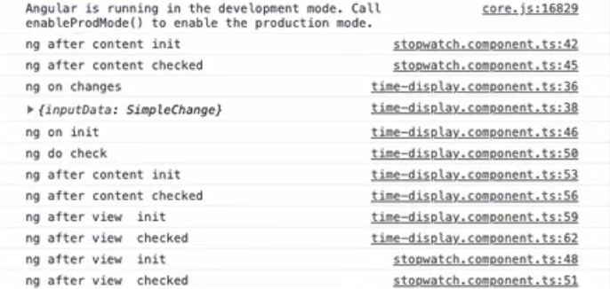

## 생명주기

- ngOnChanges
  - @Input() 값이 바인딩되면서 실행
    - @Input(): 외부로 부터 주입된 데이터
  - 가장 먼저 실행
  - @Input() 값이 변경될 때 마다 실행
- ngOnInit
  - 외부로부터 데이터가 주입된 것을 확인하고 실제 컴포넌트가 생성될 때 실행
  - 초기화할 때 한번 실행됨
- ngDoCheck
  - 컴포넌트 내에 변경이 감지되면 실행

 

- ngAfterContentInit
  - 나의 컴포넌트가 바뀐 시점
    - 예를 들어, children을 내려준 경우 `<ng-content></ng-content>` 에서 보여지는데 이때 실행
- ngAfterContentChecked

 

- ngAfterViewInit
  - 자식 컴포넌트가 모두 렌더링된 후 실행
- ngAfterViewChecked

 

- ngDestroy
  - 컴포넌트가 제거될 때 실행

 
 

---

# StudyAngular

This project was generated with [Angular CLI](https://github.com/angular/angular-cli) version 16.2.4.

## Development server

Run `ng serve` for a dev server. Navigate to `http://localhost:4200/`. The application will automatically reload if you change any of the source files.

## Code scaffolding

Run `ng generate component component-name` to generate a new component. You can also use `ng generate directive|pipe|service|class|guard|interface|enum|module`.

## Build

Run `ng build` to build the project. The build artifacts will be stored in the `dist/` directory.

## Running unit tests

Run `ng test` to execute the unit tests via [Karma](https://karma-runner.github.io).

## Running end-to-end tests

Run `ng e2e` to execute the end-to-end tests via a platform of your choice. To use this command, you need to first add a package that implements end-to-end testing capabilities.

## Further help

To get more help on the Angular CLI use `ng help` or go check out the [Angular CLI Overview and Command Reference](https://angular.io/cli) page.
